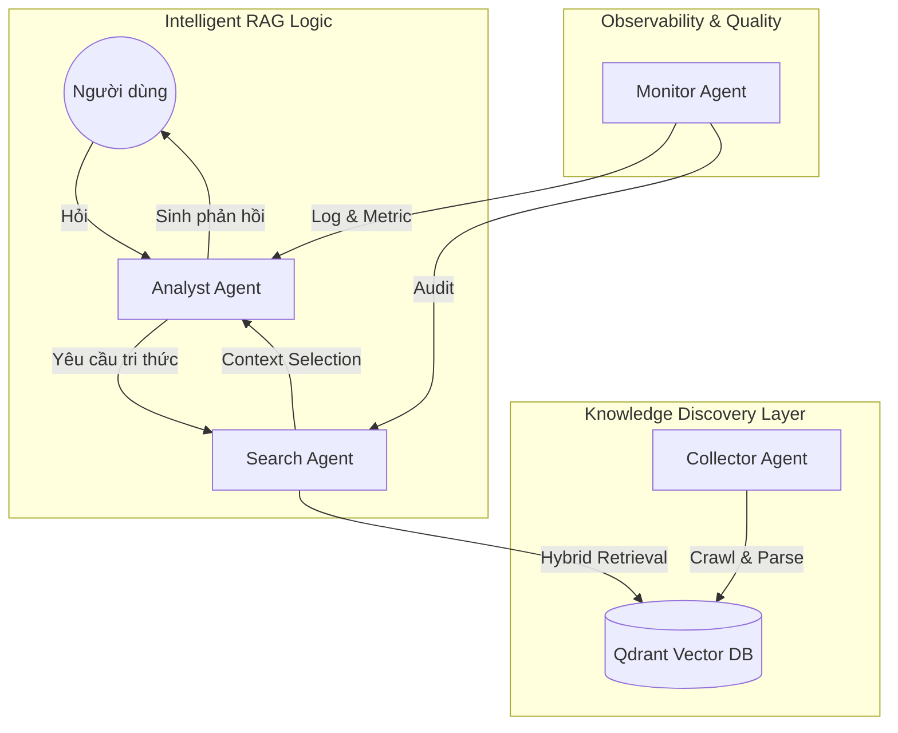
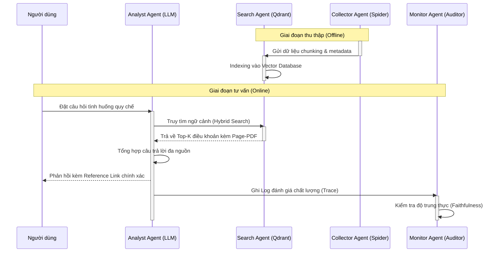

BÁO CÁO CHI TIẾT KẾT QUẢ THỰC HIỆN (Progress #1)

**ĐỀ TÀI:** Thiết kế và xây dựng hệ thống đa tác nhân (Multi-Agent) hỗ trợ tra cứu và tư vấn Quy chế nội bộ Trường Đại học Thủy Lợi trên nền tảng Điện toán đám mây.

**Tuần thực hiện:** Tuần 1 - 2.
**Giai đoạn:** Tuần 1 - 2.
**Người thực hiện:** Nguyễn Xuân Tài.


### 1. Tổng quan và Căn cứ Khoa học

Hệ thống được thiết kế dựa trên sự giao thoa của ba trụ cột công nghệ hiện đại, nhằm giải quyết bài toán tra cứu văn bản pháp quy phức tạp tại Trường Đại học Thủy Lợi:

*   **Hệ thống Đa tác nhân (Multi-Agent System - MAS)**: Thay vì một khối xử lý duy nhất, hệ thống phân rã thành các tác nhân tự chủ (Agents). Mỗi tác nhân sở hữu một nhiệm vụ chuyên biệt (Collector, Search, Analyst, Monitor), giao tiếp thông qua giao thức nhẹ, giúp tăng khả năng mở rộng và chịu lỗi.
*   **Mô hình RAG (Retrieval-Augmented Generation)**: Thành phần then chốt trong việc tư vấn thông minh. RAG kết hợp khả năng xử lý ngôn ngữ tự nhiên của mô hình ngôn ngữ lớn (Large Language Model - LLM) với kho tri thức thực tế được trích xuất từ quy chế Nhà trường, giúp khắc phục triệt để hiện tượng phản hồi sai lệch (hallucination).
*   **Kiến trúc Cloud-Native & Microservices**: Hệ thống thực hiện nguyên tắc "Mỗi tác nhân là một Microservice". Thiết kế này đảm bảo vận hành bền bỉ trên hạ tầng Google Kubernetes Engine (GKE), hỗ trợ triển khai độc lập và tự động co giãn (Auto-scaling).

### 2. So sánh giải pháp: Search truyền thống vs. Agentic RAG

| Tiêu chí | Tìm kiếm truyền thống (Keyword-based) | Agentic RAG (Hệ thống đề xuất) | Ghi chú |
| :--- | :--- | :--- | :--- |
| Độ hiểu ý định | Chỉ khớp từ khóa chính xác | Hiểu ngữ nghĩa và ngữ cảnh câu hỏi | RAG vượt trội trong các tình huống thực tế |
| Độ chính xác | Trả về cả văn bản dài | Trích xuất đúng điều khoản liên quan | Tiết kiệm thời gian cho sinh viên |
| Tính trích dẫn | Khó theo dấu trang/dòng | Tự động dẫn link và trang PDF gốc | Đảm bảo tính pháp lý |
| Khả năng mở rộng | Phụ thuộc vào Index tĩnh | Tác nhân tự động cập nhật tri thức số | MAS giúp hệ thống luôn "sống" |

### 3. So sánh và Lựa chọn phương án kỹ thuật (Decision Matrix)

Trong quá trình nghiên cứu, đề tài đã xác định và lựa chọn các phương án kỹ thuật làm nền tảng cốt lõi. Nhờ kiến trúc Microservices linh hoạt, hệ thống có khả năng thay thế hoặc nâng cấp các thành phần công nghệ mà không ảnh hưởng đến cấu trúc tổng thể.

#### 3.1. Cơ chế giao tiếp giữa các Tác nhân (Communication)
| Phương án | Đặc điểm | Ưu điểm | Nhược điểm | Gợi ý áp dụng cho đề tài |
| :---- | :---- | :---- | :---- | :---- |
| **Direct API (REST)** | Gọi trực tiếp | Đơn giản, dễ lập trình | Dễ gây điểm nghẽn (Bottle-neck) | Phù hợp cho giao tiếp Client - Server |
| **Message Queue (RabbitMQ)** | Giao tiếp qua hàng đợi | Đứt gãy hệ thống vẫn lưu được Task | Cần cấu hình và quản trị Broker | **Lựa chọn**: Dùng cho giao tiếp nội bộ giữa Agent |

#### 3.2. Chiến lược triển khai Mô hình ngôn ngữ (LLM Deployment)
| Phương án | Độ trễ | Bảo mật dữ liệu | Chi phí | Ghi chú / Lựa chọn |
| :---- | :---- | :---- | :---- | :---- |
| **Cloud API (OpenAI/Google Gemini)** | Cao (phụ thuộc Network) | Thấp (Dữ liệu gửi ra ngoài) | Trả phí theo Token | Tiện dụng cho giai đoạn thực nghiệm (Proof of Concept - PoC) |
| **Self-hosted (Llama-3 on GKE)** | Thấp (Mạng nội bộ) | Rất cao (Dữ liệu trong Cluster) | Chi phí hạ tầng cố định | **Lựa chọn**: Đảm bảo quyền riêng tư cho Quy chế TLU |

#### 3.3. So sánh các cơ chế Tra cứu (Retrieval)
| Cơ chế | Chính xác từ khóa | Hiểu ngữ nghĩa | Tài nguyên | Gợi ý áp dụng |
| :---- | :---- | :---- | :---- | :---- |
| **Keyword Search (Elastic)** | Rất cao | Thấp | Thấp | Phù hợp tra số hiệu văn bản |
| **Vector Search (Dense)** | Trung bình | Rất cao | Cao | Phù hợp tra cứu theo tình huống |
| **Hybrid Search (Qdrant)** | Rất cao | Rất cao | Cao | **Lựa chọn**: Kết hợp ưu điểm cả 2 phương án |


### 4. Định nghĩa Stack công nghệ Đề xuất (Tech Stack)

Để phục vụ việc xử lý ngôn ngữ tự nhiên cấp cao, đề tài áp dụng các công nghệ hiện đại nhất trong hệ sinh thái Python:

*   **Ngôn ngữ**: Python 3.10+ (Framework FastAPI cho hiệu năng xử lý bất đồng bộ).
*   **Xử lý văn bản**: `PyMuPDF` và `Marker-PDF` để bóc tách cấu trúc văn bản pháp quy phức tạp của Nhà trường.
*   **Cơ sở dữ liệu Vector**: `Qdrant` (Hỗ trợ Hybrid Search: Dense Vector + Sparse BM25).
*   **LLM Engine**: `Llama-3-8B` (đề xuất) – Có khả năng thay thế linh hoạt bằng các bản nâng cấp hoặc các Open-source Models tương đương.
*   **Orchestration**: `RabbitMQ` làm trục xương sống cho MAS phối hợp hành động.

### 5. Hệ thống hóa Kho tri thức số (Knowledge Source Manifest)

Hệ thống đã chuẩn hóa việc thu nhập từ 06 nguồn tin cốt lõi của Trường Đại học Thủy Lợi, đảm bảo nguyên tắc *Single Source of Truth*:

1.  **Quy chế Đào tạo**: [tlu.edu.vn/dao-tao](https://tlu.edu.vn/dao-tao/dai-hoc-chinh-quy/) (Phòng Đào tạo).
2.  **Công tác Sinh viên**: [ctsv.tlu.edu.vn](https://ctsv.tlu.edu.vn/) (Phòng CTSV - Học bổng, rèn luyện).
3.  **Xét tốt nghiệp**: [daotao.tlu.edu.vn](https://daotao.tlu.edu.vn/) (Phòng Đào tạo).
4.  **Học phí & Chính sách**: [tlu.edu.vn/sinh-vien/hoc-phi](https://tlu.edu.vn/sinh-vien/hoc-phi/).
5.  **Văn bản Pháp quy**: [web18.tlu.edu.vn/Van-ban](https://web18.tlu.edu.vn/Van-ban).
6.  **Khen thưởng/Kỷ luật**: [ctsv.tlu.edu.vn/chinh-sach-sinh-vien](https://ctsv.tlu.edu.vn/chinh-sach-sinh-vien/).

### 6. Thiết kế Kiến trúc Đa tác nhân (MAS Architecture)

Sơ đồ phối hợp giữa 04 Tác nhân chính, tương ứng với 04 dịch vụ (Microservices) vận hành độc lập:



### 7. Luồng xử lý RAG Pipeline

Quy trình RAG được thiết kế theo 04 giai đoạn chính yếu:
1.  **Retrieval**: Tra cứu Vector kết hợp từ khóa BM25 để lấy ra Top-K đoạn văn bản liên quan.
2.  **Re-ranking**: Sử dụng Cross-Encoder để xếp hạng lại độ chính xác, loại bỏ nhiễu thông tin.
3.  **Augmented**: Xây dựng Prompt "giàu ngữ cảnh" chứa các điều khoản luật đã được lọc.
4.  **Generation**: LLM tổng hợp câu trả lời tiếng Việt theo phong cách tư vấn pháp lý chuyên nghiệp.

### 8. Phân tích thiết kế hệ thống (PTTK)

Hệ thống được thiết kế theo hướng module hóa cao, đảm bảo đầy đủ các chức năng phục vụ cả người dùng cuối và quản trị viên vận hành.

#### 8.1. Sơ đồ Use Case Tổng quát

```mermaid
usecaseDiagram
    actor "Sinh viên / Cán bộ" as User
    actor "Quản trị viên" as Admin
    actor "Hệ thống MAS" as MAS
    
    package "Nhóm Tra cứu & Tư vấn (User)" {
        usecase "Tư vấn quy chế thông minh (RAG)" as UC1
        usecase "Tra cứu văn bản theo số hiệu/từ khóa" as UC2
        usecase "Xem trích dẫn pháp lý & văn bản gốc" as UC3
        usecase "Đăng ký/Đăng nhập" as UC4
        usecase "Phản hồi/Đánh giá chất lượng AI" as UC5
    }
    
    package "Nhóm Quản trị Tri thức (Admin)" {
        usecase "Quản lý nguồn tin (Landing Pages)" as UC6
        usecase "Phê duyệt dữ liệu bóc tách PDF" as UC7
        usecase "Quản lý kho thư viện văn bản" as UC8
    }
    
    package "Nhóm Giám sát & Vận hành (System)" {
        usecase "Theo dõi hiệu năng các Agent" as UC9
        usecase "Giám sát lịch sử câu hỏi người dùng" as UC10
        usecase "Đánh giá độ chính xác RAG" as UC11
    }
    
    User --> UC1
    User --> UC2
    User --> UC3
    User --> UC4
    User --> UC5
    
    Admin --> UC6
    Admin --> UC7
    Admin --> UC8
    Admin --> UC9
    Admin --> UC10
    Admin --> UC11
    
    MAS --> UC1
    MAS --> UC6
    MAS --> UC9
    
    UC1 ..> UC4 : <<include>>
    UC2 ..> UC4 : <<include>>
    UC3 ..> UC4 : <<include>>
    UC5 ..> UC4 : <<include>>
    UC6 ..> UC4 : <<include>>
    UC7 ..> UC4 : <<include>>
    UC8 ..> UC4 : <<include>>
    UC9 ..> UC4 : <<include>>
    UC10 ..> UC4 : <<include>>
    UC11 ..> UC4 : <<include>>
```

#### 8.2. Đặc tả các Tác nhân (Actors)
*   **Người dùng (Student/Staff)**: Đối tượng thụ hưởng dịch vụ tra cứu và tư vấn thông minh để giải quyết các vướng mắc về quy định nội bộ Nhà trường.
*   **Quản trị viên (Admin)**: Chịu trách nhiệm cấu hình nguồn tin, kiểm soát chất lượng dữ liệu bóc tách và giám sát tính ổn định của hệ thống.
*   **Hệ thống Đa tác nhân (MAS)**: Đóng vai trò tác nhân hệ thống (System Actor), tự động hóa các tiến trình ngầm như Crawling (Collector Agent), Indexing (Search Agent) và Health-check (Monitor Agent).

#### 8.3. Luồng tương tác Use Case trọng tâm: Tư vấn thông minh (RAG Flow)

Sơ đồ tuần tự (Sequence Diagram) mô tả sự phối hợp giữa các tác nhân trong kiến trúc MAS khi xử lý một yêu cầu tư vấn:



### 9. Chiến lược đảm bảo tính Tin cậy và Giám sát (Reliability & Observability)

Để hệ thống không chỉ "thông minh" mà còn "bền bỉ" (Resilient), kiến trúc áp dụng các Pattern đặc thù từ Microservices:

*   **Idempotency (Tính nhất quán)**: Collector Agent được thiết kế để dù chạy lại nhiều lần cho cùng một file PDF cũng không gây trùng lặp dữ liệu nhờ cơ chế kiểm tra mã băm (file hash).
*   **Heartbeat Monitoring**: Tác nhân Monitor định kỳ gửi tín hiệu kiểm tra sức khỏe (health-check) tới các Agent. Nếu Analyst Agent (LLM) bị treo, hệ thống sẽ tự động khởi tạo lại Pod (đơn vị triển khai nhỏ nhất trong Kubernetes) trên cụm GKE.
*   **Traced Logs**: Mỗi yêu cầu tư vấn được gắn một mã định danh liên kết (Correlation-ID) duy nhất, giúp Monitor Agent theo vết được luồng xử lý từ lúc người dùng đặt câu hỏi đến lúc nhận phản hồi.

### 10. Các thách thức và Anti-patterns cần phòng tránh

Rút kinh nghiệm từ các hệ thống MAS/RAG truyền thống, đề tài chủ động phòng tránh các lỗi phổ biến sau:

*   **Hallucination (Ảo giác AI)**: Khắc phục bằng cách áp dụng *Context-constrained Prompting* (Chỉ trả lời trong phạm vi dữ liệu quy chế được cung cấp).
*   **Distributed Monolith (Khối phân tán)**: Tránh việc các tác nhân phụ thuộc quá chặt chẽ vào nhau bằng cách sử dụng RabbitMQ làm trung gian giao tiếp bất đồng bộ.
*   **Outdated Data (Dữ liệu cũ)**: Sử dụng cơ chế *Incremental Crawling* (Cào bổ sung) để chỉ cập nhật những văn bản có thay đổi, tối ưu tài nguyên hạ tầng.


### 11. Thiết kế Mô hình dữ liệu Metadata (Traceability)

Để đảm bảo tính dẫn chứng pháp lý, mô hình dữ liệu được thiết kế theo hướng hỗ trợ truy xuất nguồn gốc:

*   **Bảng Regulation**: Lưu trữ URL gốc, định danh văn bản và mã băm nội dung để phát hiện cập nhật.
*   **Bảng RegulationChunk**: Lưu trữ đoạn văn bản kèm chỉ mục trang (`page_index`) và phân cấp đề mục (`heading_hierarchy`) để người dùng dễ dàng đối chiếu.

### 12. Hạ tầng Cloud-Native (GKE Deployment)

Hệ thống được đóng gói hoàn toàn bằng Docker, trong đó mỗi tác nhân (Agent) vận hành như một Microservice độc lập trên cụm Google Kubernetes Engine (GKE). 
*   **Resilience**: Sử dụng RabbitMQ đảm bảo tin nhắn không bị mất khi hệ thống quá tải.
*   **Scaling**: Tác nhân Search cho phép thực hiện tự động co giãn (Horizontal Pod Autoscaler - HPA) theo lưu lượng truy vấn thực tế.

### 13. Checklist chất lượng Đồ án (Quality Assurance)

□ Hệ thống đa tác nhân được phân rã theo miền nghiệp vụ thực tế.
□ Kho tri thức số cập nhật từ 06 nguồn tin chính thống của Nhà trường.
□ Luồng RAG có bước Re-ranking đảm bảo độ chính xác pháp lý.
□ Dữ liệu Metadata hỗ trợ truy xuất nguồn gốc đến cấp độ trang PDF.
□ Toàn bộ dịch vụ được triển khai Cloud-native trên Kubernetes.


### 14. Định hướng triển khai Giai đoạn kế tiếp (Tuần 3 - 5)

1.  **Làm phong phú dữ liệu**: Phối hợp cùng giáo viên hướng dẫn (TS. Đỗ Oanh Cường và ThS. Phạm Nguyệt Nga) để thu thập thêm hơn 20 văn bản quy chế ngoại tuyến (offline).
2.  **Xây dựng Collector Agent**: Triển khai logic bóc tách văn bản quy chế và đẩy dữ liệu vào kho lưu trữ Vector DB.
3.  **Phát triển API lõi**: Hoàn thiện các dịch vụ API tra cứu phục vụ cho tác nhân phân tích nội dung.

### 15. Tài liệu tham khảo (References)

Dưới đây là các tài liệu và nguồn tham khảo chính được đề tài sử dụng trong giai đoạn nghiên cứu và thiết kế:

1.  **LangChain Documentation**: [python.langchain.com](https://python.langchain.com/) - Tài liệu hướng dẫn xây dựng ứng dụng LLM.
2.  **Qdrant Vector Database**: [qdrant.tech/documentation](https://qdrant.tech/documentation/) - Hướng dẫn triển khai Hybrid Search và Vector Indexing.
3.  **RabbitMQ Tutorials**: [rabbitmq.com/getstarted.html](https://www.rabbitmq.com/getstarted.html) - Các mô hình giao tiếp hàng đợi tin nhắn.
4.  **Google Kubernetes Engine (GKE)**: [cloud.google.com/kubernetes-engine](https://cloud.google.com/kubernetes-engine/docs) - Tài liệu triển khai hệ thống Cloud-native.
5.  **Marker-PDF Parsing**: [github.com/VikParuchuri/marker](https://github.com/VikParuchuri/marker) - Thư viện bóc tách cấu trúc văn bản PDF.

### 16. Liên kết Mã nguồn (Project Repository)

Toàn bộ mã nguồn, cấu hình hạ tầng và nhật ký phát triển được lưu trữ và cập nhật tại:

*   **Repository URL**: [Dán link GitHub/Lab của Tài tại đây]
*   **Chi tiết**: Bao gồm Dockerfiles, K8s manifests và mã nguồn các Agents.


