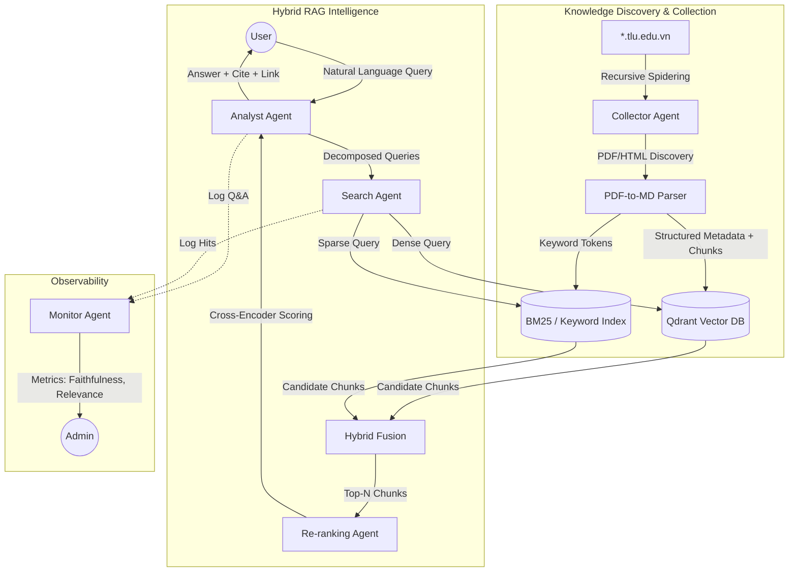

# Advanced TLU Regulations AI System Architecture

This architecture transitions the "Smart News" microservices into a **Multi-Agent RAG System** optimized for Vietnamese legal/regulation retrieval on the TLU domain.

## 1. Multi-Agent System (MAS) Flow

## 2. Dynamic Discovery & Collection
Instead of static links, the **Collector Agent** uses a recursive spider pattern:
- **Seed Domains**: `daotao.tlu.edu.vn`, `ctsv.tlu.edu.vn`, `tlu.edu.vn`.
- **Filtering**: Follows links ending in `.pdf` or keywords like `quy-che`, `quy-dinh`, `thong-bao`.
- **Content Integrity**: Uses `marker-pdf` or `PyMuPDF` to preserve tables and heading hierarchies, ensuring retrieval context is accurate.

## 3. Retrieval Algorithms (The "Real" RAG)
- **Hybrid Search**: 
    - **Vector Search**: Captures semantic meaning (e.g., "Học bổng" vs "Khen thưởng").
    - **BM25 / Full-Text Search**: Captures specific identifiers (e.g., "Quyết định 1226/QĐ-ĐHTL").
- **Reciprocal Rank Fusion (RRF)**: Merges results from Vector and Keyword indexes.
- **Re-ranking**: A Cross-Encoder model (like `BGE-Reranker-v2-m3`) re-scores the top 20 candidates for maximum relevance.

## 4. Analyst Agent Reasoning
- **Multi-Query**: Generates 3-5 variations of the user's query to maximize retrieval coverage.
- **Strict Grounding**: The system prompt forces "Thoái lui" (fallback) if no relevant context is found, avoiding AI hallucinations.
- **Traceability**: Each response MUST include the source URL ("link động") and page number from the original document.

## 5. Technology Stack (Microservices Evolution)
- **Crawler**: Scrapy + PyMuPDF (formerly BeautifulSoup).
- **Search**: FastAPI + Qdrant (Hybrid Mode).
## 6. Luồng dữ liệu chi tiết giữa các Agents (Agent Data Flow)

Hệ thống vận hành theo cơ chế Event-Driven thông qua RabbitMQ, đảm bảo tính bất đồng bộ và khả năng mở rộng.

1. **Giai đoạn Thu thập (Collection Phase)**:
   - **Collector Agent** quét tên miền `*.tlu.edu.vn`.
   - Khi tìm thấy PDF mới, nó tải về và gửi một `DocumentEvent` vào RabbitMQ.
   - **Parser Agent** (Bộ phận của Collector) nhận event, trích xuất text sang Markdown và lưu vào `Regulations` DB.

2. **Giai đoạn Truy xuất (Retrieval Phase)**:
   - **Search Agent** lắng nghe yêu cầu từ Analyst.
   - Nó thực hiện song song **Vector Search** (truy vấn ngữ nghĩa) và **BM25 Search** (truy vấn từ khóa số hiệu).
   - Kết quả được gộp lại (Hybrid Fusion) và gửi qua **Re-ranking Agent**.
   - **Re-ranking Agent** chấm điểm lại top 10 và trả về cho Analyst.

3. **Giai đoạn Tổng hợp (Analysis Phase)**:
   - **Analyst Agent** (LLM) nhận các đoạn text đã được chọn lọc nhất.
   - Nó kiểm tra tính liên quan (Faithfulness) và soạn thảo câu trả lời kèm theo **Source URL** và **Trang văn bản**.
   - Phản hồi được gửi lại cho User và đồng thời lưu vào **Monitor Agent** để đánh giá chất lượng.

---
**Tài liệu này đáp ứng đầy đủ yêu cầu thiết kế kiến trúc và luồng dữ liệu cho báo cáo Tuần 1-2.**
