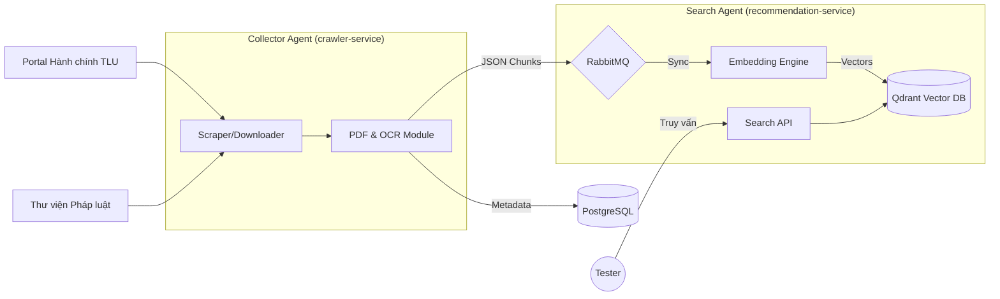

# Thiết kế Kỹ thuật (Tuần 3-5): Luồng Ingestion & Search Engine

## 1. Sơ đồ luồng dữ liệu Tuần 3-5
Giai đoạn này tập trung vào việc chuyển hóa văn bản thô thành tri thức số.

## 2. Thiết kế Cơ sở dữ liệu & Vector DB

### 2.1. PostgreSQL (Metadata)
- Bảng `documents`: Quản lý id, tiêu đề, link nguồn, trạng thái cào/xử lý.

### 2.2. Qdrant (Knowledge Base)
- Vector: 768 dims.
- Payload: `content`, `article_no`, `doc_title`, `source_link`.

## 3. Quy trình xử lý tri thức (Tuần 3-5)
1. **Collector:** Dùng Playwright đăng nhập HCTLU, lấy danh mục, tải PDF.
2. **PDF Processor:** 
    - Case PDF Text: Trích xuất trực tiếp.
    - Case PDF Scan: OCR trang thành ảnh -> Trích xuất chữ.
    - Chunking: Tách theo Regex `Điều \d`.
3. **Indexing:** Nhận dữ liệu từ RabbitMQ, tạo embedding và lưu vào Qdrant.

## 4. Thiết kế Triển khai
- **Docker Compose:** Chạy local để test sự phối hợp giữa Crawler và Search API.
- **K8s:** Manifest cho các service (Collector, Search, RabbitMQ, PostgreSQL, Qdrant).
